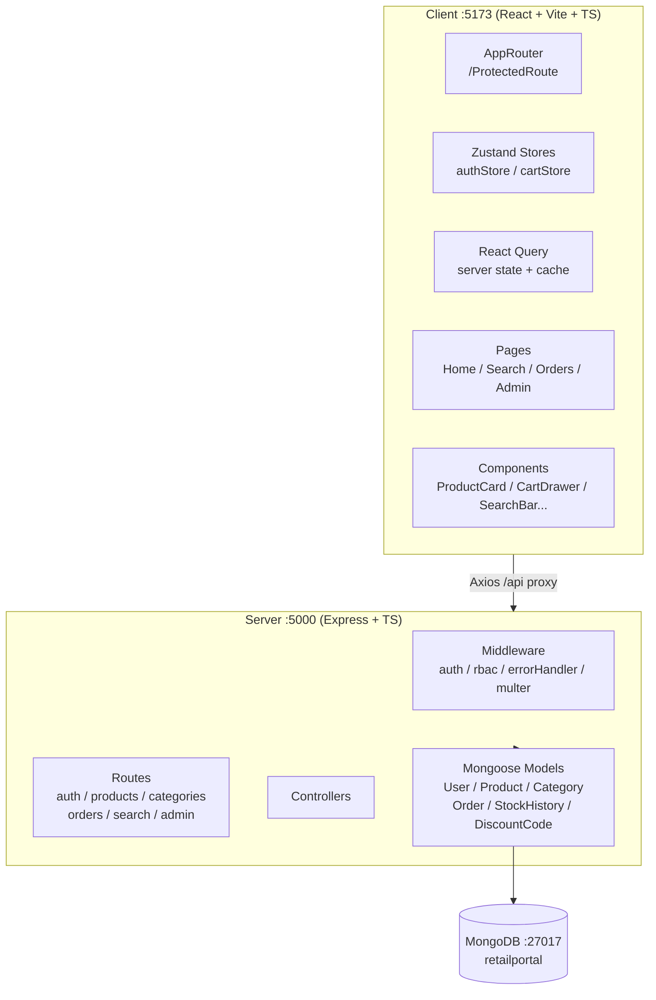

# Retail Portal — Implementation Plan

Full TypeScript monorepo. Single `npm run dev` starts everything. MongoDB Compass local on `:27017`.

## Architecture Overview




---

## Phase 1 — Project Scaffolding

**What:** Root `package.json` with `concurrently` scripts, server folder init with `tsx` + Express deps, client scaffold via `vite create` React-TS template, both `tsconfig.json` files, `.env.example`, `.gitignore`.

**Key files created:**

- `package.json` — root scripts: `dev`, `server`, `client`, `seed`, `install:all`
- `server/tsconfig.json` — CommonJS, ES2020, strict
- `client/tsconfig.json` — standard Vite React TS
- `client/vite.config.ts` — proxy `/api` → `http://localhost:5000`
- `.env.example` — all 7 variables with placeholders
- `.env` — filled with actual secrets

**Verify:** `npm run install:all` completes without errors. `npm run client` opens blank Vite page at `:5173`. `npm run server` starts Express and logs `Server running on port 5000`.

---

## Phase 2 — Server: Models + DB + Middleware

**What:** MongoDB connection, all 6 Mongoose models, global middleware stack.

**Key files:**

- `server/src/config/db.ts` — `mongoose.connect()`, logs on success/failure
- `server/src/models/User.ts` — includes `apiKey`, single `refreshToken`
- `server/src/models/Product.ts` — includes `$text` index: `{ title: 10, tags: 5, description: 1 }`
- `server/src/models/Category.ts` — auto-slug from name
- `server/src/models/Order.ts` — price snapshot on items
- `server/src/models/StockHistory.ts`
- `server/src/models/DiscountCode.ts`
- `server/src/middleware/auth.ts` — Bearer JWT → then `x-api-key` → else 401
- `server/src/middleware/rbac.ts` — `requireRole(...roles)`
- `server/src/middleware/errorHandler.ts` — standard `{ success, error: { code, message, status } }` envelope
- `server/src/middleware/upload.ts` — Multer, dest `server/src/uploads/`

**Verify:** `npm run server` → MongoDB connects, no TS errors. Open Compass → `retailportal` DB exists (empty collections auto-created on first write is fine).

---

## Phase 3 — Server: Auth + Core APIs

**What:** All API routes in three groups — Auth, then Categories+Products, then Orders+Admin. Validators inline using `express-validator`.

**Auth endpoints** (`server/src/routes/authRoutes.ts`):

- `POST /api/auth/signup` → hash password, `crypto.randomUUID()` apiKey, return `{ user, accessToken, refreshToken, apiKey }`
- `POST /api/auth/login` → compare hash, issue tokens, store `refreshToken` on User doc
- `POST /api/auth/refresh` → verify refresh token, issue new access token
- `POST /api/auth/logout` → clear `refreshToken` field

**Categories + Products** (`categoryRoutes.ts`, `productRoutes.ts`):

- Public GETs return standard envelope with `meta` on paginated endpoints
- Admin POSTs/PUTs use `upload.array('images')` via Multer
- `PATCH /api/products/:id/stock` → atomic `findOneAndUpdate` with `$inc`, creates `StockHistory` doc

**Search** (`searchRoutes.ts`):

- `GET /api/search/suggest` → regex `^term` on title, limit 8, populate category
- `GET /api/search` → `$text: { $search: term }`, textScore sort, paginated

**Orders + Admin** (`orderRoutes.ts`, `adminRoutes.ts`):

- `POST /api/orders` → validate stock per item, apply discount code (inline), `$inc` stock atomically, snapshot prices, create order
- `POST /api/orders/:id/reorder` → return `{ cartItems }` from order snapshots
- Admin routes all require `requireRole('admin')`

**Verify (Postman):**

1. `POST /api/auth/signup` → 201, has `accessToken` + `apiKey`
2. `POST /api/auth/login` → 200
3. `GET /api/categories` → 200 (empty array is fine pre-seed)
4. `POST /api/categories` with `adminToken` → 201
5. `POST /api/categories` with `accessToken` (user) → 403 `FORBIDDEN`
6. `PATCH /api/products/:id/stock` → StockHistory doc created in Compass

---

## Phase 4 — Seed Script

**What:** Idempotent `seed.ts` using the full product catalog from [dev_docs/seed_enrichment.md](dev_docs/seed_enrichment.md).

`**server/src/scripts/seed.ts` seeds in order:**

1. Admin user (`admin@demo.com` / `Admin@123`) + regular user (`user@demo.com` / `User@123`)
2. 6 categories — Burgers, Sides, Drinks, Desserts, Combos, Veg Specials — with LoremFlickr logo URLs
3. 30 products (5 per category) — realistic names, ₹79–₹799 costs, strategic stock levels (2 at stock=0, 3 at stock≤5 for badge demo)
4. Wire `addOns` + `combos` arrays after all products inserted
5. 3 discount codes: `SAVE10`, `FLAT50`, `DEMO20`
6. 3 sample orders for `user@demo.com` with statuses `delivered`, `preparing`, `pending`

**Verify:** `npm run seed` completes. Compass shows: `users` (2 docs), `categories` (6), `products` (30), `discountcodes` (3), `orders` (3). Run seed again — no duplicates created.

---

## Phase 5 — Client Foundation

**What:** Types, stores, API layer, router, layouts — everything the pages sit on top of.

**Key files:**

- `client/src/types/index.ts` — interfaces: `User`, `Product`, `Category`, `Order`, `CartItem`, `ApiResponse<T>`, `PaginatedResponse<T>`
- `client/src/utils/` — `formatCurrency.ts` (₹ formatter), `calcTaxedPrice.ts`, `debounce.ts`
- `client/src/api/axiosInstance.ts` — base URL from `VITE_API_BASE_URL`, request interceptor injects Bearer token from `authStore`, response interceptor on 401 → silent refresh → retry
- `client/src/store/authStore.ts` — Zustand: `user`, `accessToken`, `role`, `setAuth`, `clearAuth`
- `client/src/store/cartStore.ts` — Zustand + persist middleware → `localStorage` key `retailportal-cart`
- `client/src/router/AppRouter.tsx` — React Router v6 routes tree
- `client/src/router/ProtectedRoute.tsx` — redirect to `/login` if not authed; redirect to `/` if wrong role
- `client/src/layouts/PublicLayout.tsx` — Header + Breadcrumb + `<Outlet />` + Footer
- `client/src/layouts/AdminLayout.tsx` — collapsible sidebar + topbar + `<Outlet />`

**Verify:** `npm run dev` → home page renders (empty). `/login` page renders form. Navigating to `/admin` without auth redirects to `/login`. Navigating to `/admin` as a `user` role redirects to `/`.

---

## Phase 6 — UI Component Library + Home Page

**What:** Reusable primitives first, then the full KFC-style home page.

**UI primitives** (`client/src/components/ui/`):

- `Skeleton.tsx` — grey block, Framer Motion `opacity: [0.5, 1, 0.5]` pulse
- `Modal.tsx` — portal-based, backdrop click to close, Framer Motion scale-in
- `Toast.tsx` — fixed bottom-right, auto-dismiss
- `Badge.tsx`, `Spinner.tsx`, `Pagination.tsx`, `LoadMore.tsx`, `Breadcrumb.tsx`

**Home page component tree:**

```
Home.tsx
  └── PublicLayout
        ├── Header (Logo | SearchBar | CartIcon | Auth buttons)
        ├── CategoryTabBar (sticky, horizontal scroll, active chip red)
        ├── Hero banner (gradient + CTA)
        ├── CategorySection × 6
        │     ├── Category header (logo + name + "View all →")
        │     ├── ProductCard × N  (or ProductCardSkeleton × 4 while loading)
        │     └── LoadMore button
        └── Footer
```

**ProductCard details:** `rounded-2xl`, `hover:scale-105`, lazy image, stock badges, taxed price via `calcTaxedPrice`, "Add" pill button (opens `AddOnModal` if `addOns.length > 0`).

**Theme:** Tailwind config extended with `brand: '#C8102E'`, `offwhite: '#FAF9F6'`.

**Verify:** Home page shows all 6 category sections with product cards. LoremFlickr images load. At least 2 amber badges and 2 red badges visible. Category tab bar sticks on scroll. Clicking a chip smooth-scrolls to that section. Skeletons pulse for ~1s before products appear.

---

## Phase 7 — Search, Cart, Order History

**Search:**

- `client/src/hooks/useSearch.ts` — raw input → debounced 400ms → hits suggest (≥2 chars) + full search
- `SearchBar.tsx` — pill input, focus shows `SearchSuggestions` (Framer Motion fade-in), keyboard nav (ArrowUp/Down/Enter/Escape)
- `SearchSuggestions.tsx` — 8 rows with thumbnail + title + CategoryChip + skeleton loading state
- `/search` page — left sidebar (category filter), right `ProductGrid` with infinite scroll via `useInfiniteProducts`

**Cart:**

- `CartIcon.tsx` — bag icon + badge (Framer Motion bounce on count change)
- `CartDrawer.tsx` — Framer Motion slide-in x:`100%`→`0`, backdrop blur, order summary, discount code input, "Place Order" → clears cart → `/orders`
- `CartItem.tsx` — qty stepper, remove button, line total

**Order History (`/orders`):**

- Paginated list via `GET /api/orders`
- `OrderCard.tsx` — expandable, status badge colors, "Reorder" button
- Empty state with "Browse Menu" CTA

**Verify:**

- Type `"sp"` in SearchBar → dropdown shows Spicy Zinger + others
- Press ArrowDown → highlight moves; Enter → navigates to `/search`
- Add 2 products to cart → CartIcon badge shows `2`, bounces
- Refresh page → cart still has 2 items (localStorage persist)
- Apply `SAVE10` in CartDrawer → total recalculates
- Place order → redirected to `/orders`, new order with amber "pending" badge

---

## Phase 8 — Admin Panel + Postman + README

**Admin pages:**

- `Dashboard.tsx` — 4 summary stat cards + recent orders table
- `Products.tsx` — searchable/filterable table, 20/page, "Add Product" → `ProductForm` modal
- `ProductForm.tsx` — React Hook Form + Zod, all fields including `addOns` multi-select + `ImageUploadZone` (drag-and-drop, preview grid)
- `Categories.tsx` — card grid + `CategoryForm` modal with logo upload
- `StockUpdate.tsx` — product search → current stock display → delta form → `StockHistoryTable`
- `Orders.tsx` — table with status dropdown per row → `PUT /api/admin/orders/:id`
- `Users.tsx` — read-only user list

**Postman collection** (`postman/RetailPortal.postman_collection.json`):

- 6 folders matching master.md spec
- Collection variables: `baseUrl`, `accessToken`, `adminToken`, `apiKey`
- Login requests auto-set variables via test scripts
- Every request has: status code assertion + `success === true` + key field checks

**README.md:** Exact steps from master.md local setup section + screenshots optional.

**Verify (final quality checklist from master.md):**

- Every API returns standard envelope — spot-check 5 endpoints in Postman
- Admin route returns 403 for `user` role token
- Stock PATCH → StockHistory doc in Compass
- Order creation → product stock decremented in Compass
- Cart survives browser refresh
- No `.js` files in repo (only `.ts`/`.tsx`)
- `npm run seed` is safe to run twice

